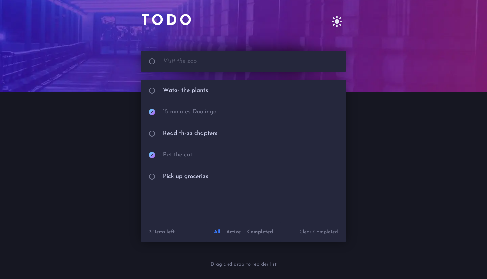

# Frontend Mentor - Todo app solution

This is a solution to the [Todo app challenge on Frontend Mentor](https://www.frontendmentor.io/challenges/todo-app-Su1_KokOW). Frontend Mentor challenges help you improve your coding skills by building realistic projects.

## Table of contents

- [Overview](#overview)
  - [The challenge](#the-challenge)
  - [Screenshot](#screenshot)
  - [Links](#links)
- [My process](#my-process)
  - [Built with](#built-with)
  - [What I learned](#what-i-learned)
  - [Continued development](#continued-development)
  - [Useful resources](#useful-resources)
- [Author](#author)
- [Acknowledgments](#acknowledgments)

## Overview

### The challenge

Users should be able to:

- View the optimal layout for the app depending on their device's screen size
- See hover states for all interactive elements on the page
- Add new todos to the list
- Mark todos as complete
- Delete todos from the list
- Filter by all/active/complete todos
- Clear all completed todos
- Toggle light and dark mode
- **Bonus**: Drag and drop to reorder items on the list

### Screenshot

### Links

- Live Site URL: [Live App Demo](http://todo-amber-psi.vercel.app/)

## My process

### Built with

- [React](https://reactjs.org/) & [NextJs](http://nextjs.com/)
- [Typescript](https://www.typescriptlang.org/)
- [Styled Components](https://styled-components.com/)
- [React Query](https://react-query.tanstack.com/) & [MSW](https://mswjs.io/) for data fetching
- [React Testing Library](https://testing-library.com/)
- [Framer Motion](https://www.framer.com/docs/animation/)
- [dnd kit](https://dndkit.com/) for drag & drop interaction

### What I learned

Building out the functional logic and semantic markup in a single component allowed me to focus on getting everything working. This could serve as an MVP so at every stage after that there was a working deliverable product. Using React Testing Library to test all of the key actions (displaying a list of todos, creating todos, completing a todo) from this beginning stage, meant that I had a suite of regression tests to give confidence in the subsequent development.

Once the core app was in place I could experiment with breakdowns of the components, ultimately separating out the containing page from a set of feature components that implemented the business logic and core app styling. Using Styled Components meant I could keep the key styles co-located with each component.

I extracted some reusable components that were not specific to any business logic. For instance an `<IconButton>`, a custom styled `<Checkbox>` and a polymorphic `<Link>` component, rendering an `<a>` or a `<button>` depending on wheter it received `href` or `onClick` props. These components could form the basis of a design system if this app was extended in future. Building in correct accessibility features (such as appropriately linked `<label>` elements, and enforcing label text props via Typescript) into these reusable components, makes it easy for developers consuming them to provide an accessible experience with no additional effort.

One approach that I would change on similar projects in the future is to build robust remote data handling from the beginning. In this project I started with mock data in a simple hard-coded array. I then created functions that could mock a remote data store using `localstorage`. This worked fine, but made some of the automated tests more difficult to write, and it differs significantly to how the app would communicate with a real server. Instead I chose to implement MockServiceWorker (MSW) and ReactQuery. MSW allowed me to set up route handlers that match the API routes that would be used in production, and ReactQuery then takes care of all of the fetching and caching of that data for use in the app. When time comes to switch the app over to production, nothing else in the app would need to change, it can immediately start to consume the real API. This had a secondary advantage in the automated tests. Test data can be provided directly to MSW, meaning none of the actual front-end app needs to be mocked, giving excellent confidence that everything works as expected.

### Continued development

In future projects I'd like to explore animation more, particularly animating SVGs.

I would also like to learn how to effectively use a screen reader. In this project I was able to test the app is accessible by keyboard, and check that appropriate roles and labels are present. But I would like to be more confortable with testing other accessibility aspects of the app.

### Useful resources

- [Inclusive Components](https://inclusive-components.design/a-todo-list/) - This helped me understand some of the more subtle accessibilty requirements, particularly around focus-management when deleting items, and creating a screen-reader notification area to announce when changes are made on screen.
- [Modern CSS](https://moderncss.dev/) - This really helped me with creating the custom checkboxes.

## Author

- Website - [Alex Marshall]https://github.com/AlexKMarshall)
- Frontend Mentor - [@AlexKMarshall](https://www.frontendmentor.io/profile/AlexKMarshall)
- Twitter - [@AlexKMarshall1](https://twitter.com/alexkmarshall1)
